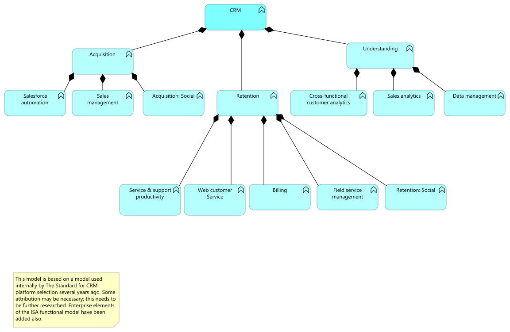
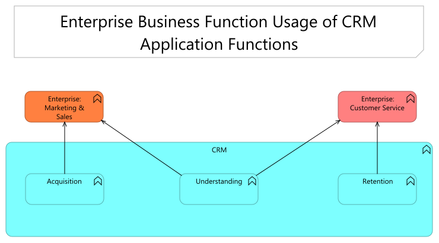

//WARNING! This file has been auto-generated. Do NOT edit it. Everything will be overwritten.

[#crm, reftext = "CRM"]
= CRM

.03. CRM functional model

 * CRM (application-function)
+
--

--
+
//-

.04. Enterprise business function usage of CRM application functions

 * CRM (application-function)
+
--

--
+
//-
