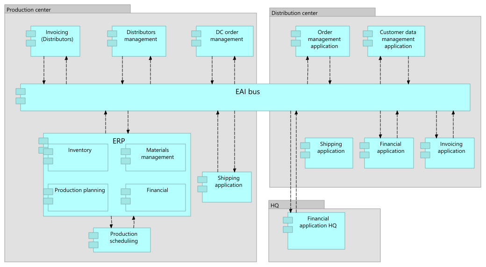
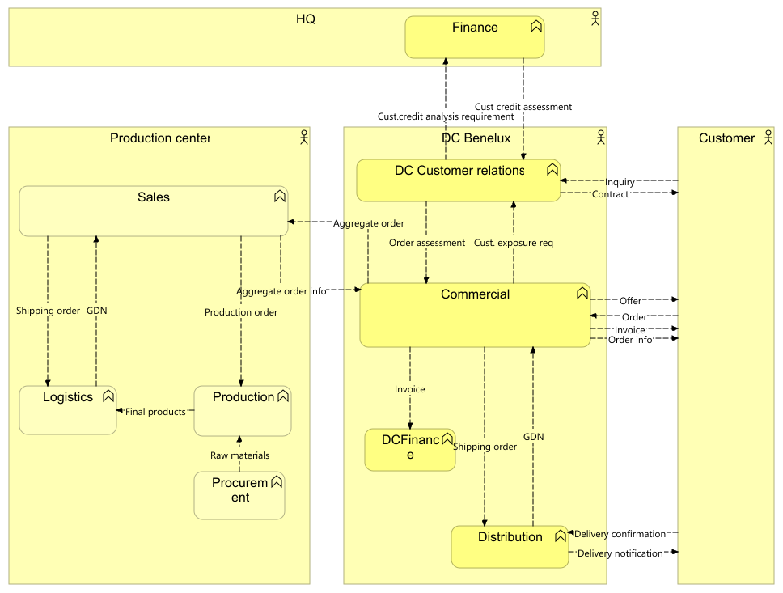

//WARNING! This file has been auto-generated. Do NOT edit it. Everything will be overwritten.

[#current_state, reftext = "Current State"]
= Current State

.Application architecture

 * Customer data management application (application-component)
+
--
Customer data management application
--
+
 * DC order management (application-component)
+
--
DC order management
--
+
 * Distributors management (application-component)
+
--
Distributors management
--
+
 * ERP (application-component)
+
--
ERP
--
+
 * Financial application (application-component)
+
--
Financial application
--
+
 * Invoicing application (application-component)
+
--
Invoicing application
--
+
 * Order management application (application-component)
+
--
Order management application
--
+
 * Shipping application (application-component)
+
--
Shipping application
--
+
//-

.Business functions

//-
