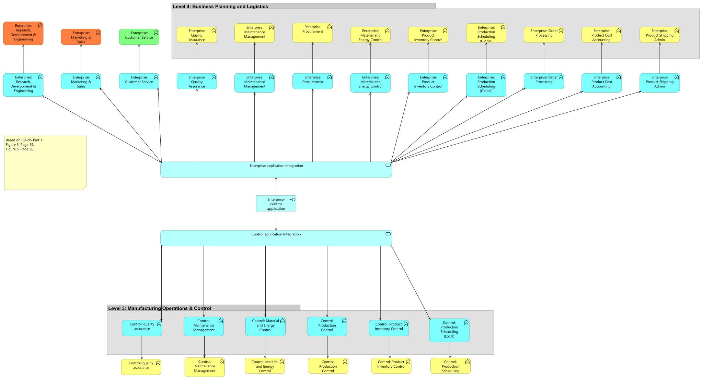
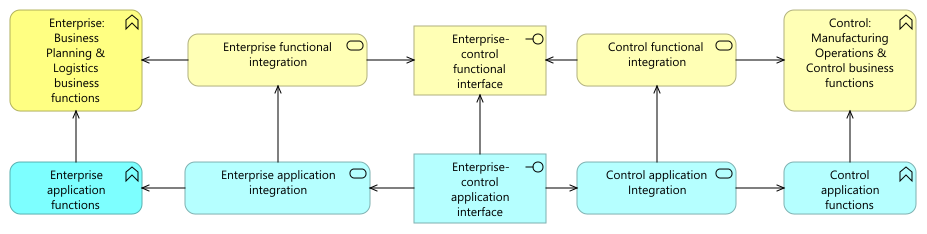
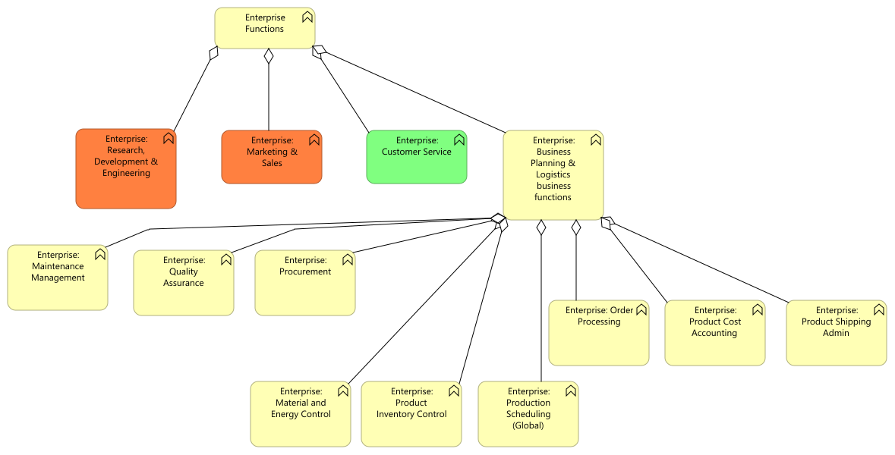
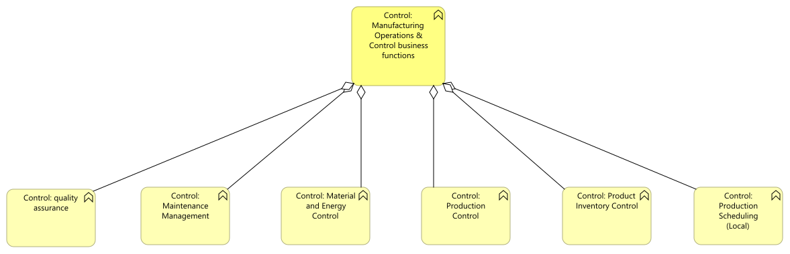

//WARNING! This file has been auto-generated. Do NOT edit it. Everything will be overwritten.

[#enterprise_level, reftext = "Enterprise Level"]
= Enterprise Level

[.landscape]
<<<

.01. Functional enterprise-control model

[.portrait]
<<<
//-

.01-1. Summary functional enterprise-control model

//-

.01-2. Enterprise functions

//-

.01-3. Control functions

//-
