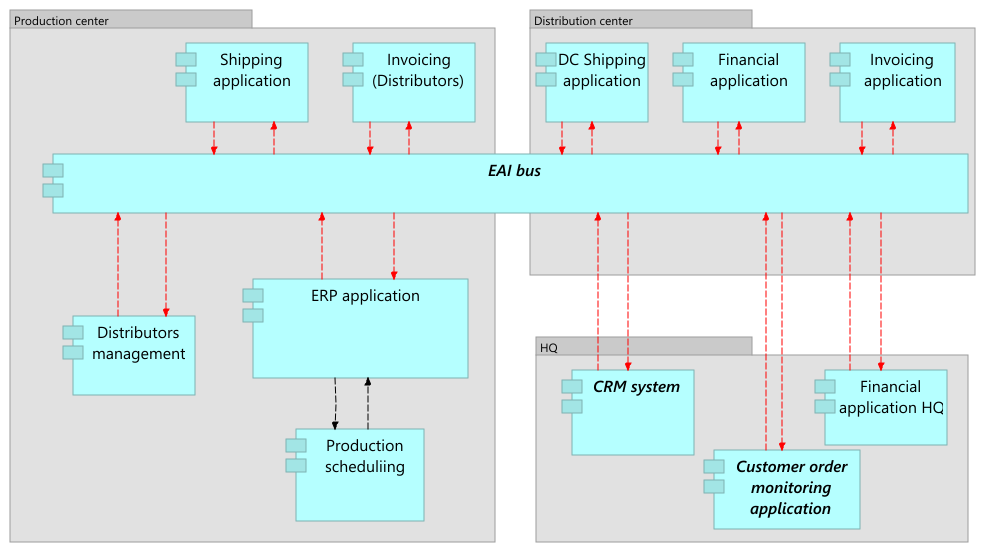
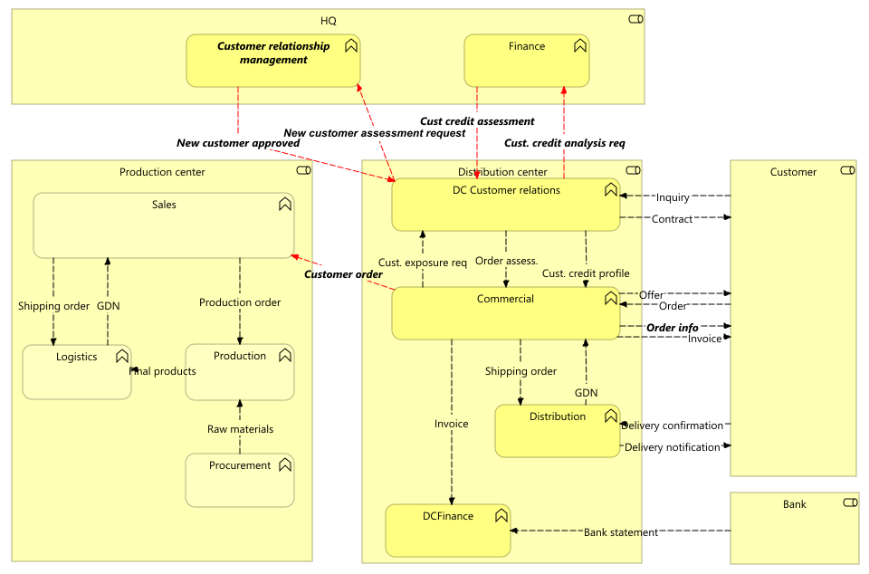

//WARNING! This file has been auto-generated. Do NOT edit it. Everything will be overwritten.

[#target_state, reftext = "Target State"]
= Target State

.Application architecture_new_1

 * Distributors management (application-component)
+
--
Distributors management
--
+
 * Financial application (application-component)
+
--
Financial application
--
+
 * Invoicing application (application-component)
+
--
Invoicing application
--
+
 * Shipping application (application-component)
+
--
Shipping application
--
+
//-

.Business functions_new

//-
